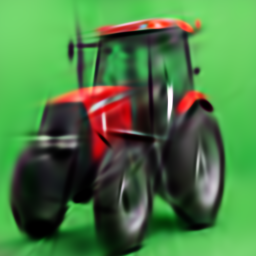
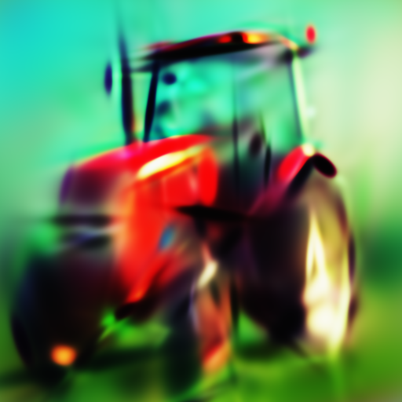
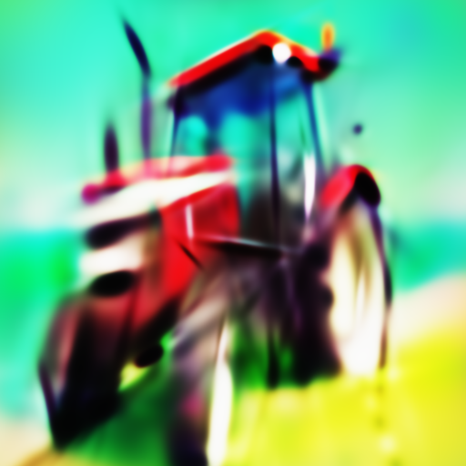
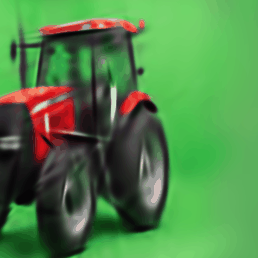

# SlapstackBet5 — Object Permanence in Gabor Packet Space

> "we prompt a tractor, a tractor appears in gabor space, background as a
> beach in miami, a beach appears, at dusk, it turns to dusk, **the tractor
> stays**."

Every clause of that sentence has now been demonstrated on real hardware.

| | |
|---|---|
|  |  |
| **205 atoms, 23.5 dB, 15 KB** — a real tractor photo reconstructed as a sparse Gabor packet set | **"at dusk"** — geometry frozen and SHA-256 verified bitwise identical; appearance channels alone relit the scene |
|  |  |
| **"a beach appears, the tractor stays"** — only the 150 background atoms received gradients; the 106-atom tractor group is bitwise untouched in *every* channel | **the glide** — pose is a Sim(2) group element: the tractor sweeps, zooms and bobs with texture phase-locked to its envelopes, zero re-optimization |

This repo contains Bets 4 and 5 of the Slapstack program: text-to-image and
image editing performed directly on a sparse set of Gabor packets — no
pixel-space generation, no trained text-to-atom model, no encoder. A scene
is a finite set of atoms (position, orientation, scale, frequency,
**envelope-relative phase**, amplitude, color) behind hard-concrete gates.
Identity lives in the intrinsic channels; pose lives in a Sim(2) group
element; edits are gradient masks over parameter subsets.

**An entire editable tractor scene is a 15 KB file.**

## Results

### Bet 4 — GO: text conjures an object from random atoms
Pure Score Distillation Sampling (frozen SD 2.1-base, cfg 50, timestep
annealing 0.98→0.50, native 512 rendering) assembled a recognizable red
tractor — chassis, cab, exhaust stack, wheels, treeline — from 256 randomly
initialized Gabor packets. No target image, no paired data, no trained
text→atom model. Separately, recon mode established the capacity bound:
205 open atoms reconstruct a real tractor photo at 23.5 dB PSNR.

### Bet 5a — GO: the tractor stays (frozen-geometry relight)
Loaded the recon atoms, froze all geometry channels plus gates, ran SDS
with *"a photo of a red tractor at dusk, golden hour, warm light"* —
gradients touching only `phase, amp, color, bg_bias`.

```
geometry fingerprint before/after: e475df55520bf8b2 / e475df55520bf8b2
    -> IDENTICAL — permanence held by construction
```

Same tractor, same pose, relit: warm highlights, lit lamps, twilight
atmosphere. Permanence here is not a property the optimizer was coaxed into
preserving (attention surgery, inversion tricks, careful prompting) — it is
a boolean mask, and the shape tensors are fingerprinted to prove it.
Honest reading: the relight reads as moody teal-warm twilight rather than
textbook golden hour (SD 2.1 mode-seeking), and with no group masks the
object and background were relit together — motivating 5b.

### Bet 5b — GO: a beach appears, the tractor stays (two-slot edit)
Crude rect-based grouping split the scene: 106 central atoms → group 0
(tractor), 150 atoms → group 1 (background). `--train-groups 1` gave
gradients to the background only; the tractor group was masked out of
**every channel** — geometry, phase, amplitude, color. Prompt:
*"a tractor on a beach in miami, ocean, sand, blue sky"*.

The background repainted — teal ocean/sky mass above, sandy yellow band
below — around a pixel-for-pixel intact tractor. This is the original
dream sentence executed literally: the edit is *which subset receives
gradients*.

Two honest notes. (1) The whole-model geometry fingerprint changed
(`e475… → cc7d…`) — this is **correct**, not a bug: background atoms'
geometry was trainable and the fingerprint hashes all atoms. Per-group
fingerprints are the obvious next tooling upgrade. (2) The beach is
impressionistic — SD 2.1's prompt-mean, again — and the rect is a crude
stand-in for real grouping: some frozen "tractor" atoms are actually
background atoms that happened to sit in the box, which is why green
lingers near the tractor. Real grouping (common-fate clustering on atom
trajectories) is Bets 2/3 territory.

### The glide — equivariance as a visible object
`--mode render --gif` sweeps a Sim(2) camera over the 205-atom tractor:
translation, zoom breathing, slight bob. Texture rides the envelopes;
envelope-relative phase means pose never touches appearance. Zero
re-optimization, ~40 rendered frames from a 15 KB file.

## Ledger

**Verified (GPU, this repo):**
- Bet 4 GO: SDS assembles a recognizable object from random atoms.
- Bet 5a GO: frozen-geometry relight; fingerprint bitwise identical;
  appearance channels sufficient to express a lighting edit.
- Bet 5b GO: group-masked SDS repaints the background around a
  bitwise-untouched object subset. Editing = choosing which atoms
  receive gradients.
- Glide: Sim(2) pose sweeps on a real reconstructed object, no
  re-optimization.
- 205 atoms / 23.5 dB / 15 KB capacity bound for a real tractor photo.
- Native-512 rendering is causal for SDS gradient quality (256→512
  bilinear upsampling destroyed structure through the VAE).
- Additive-render-into-sigmoid saturates under color-token pressure
  ("solid red" collapse); LR rebalance (color 2e-3, bg 5e-4) escapes it.

**Verified (CPU test battery, `python tests.py`, ~1 min, no SD needed):**
- Bet 4 `atoms.pt` files load directly (N inferred, group buffer defaulted).
- Sim(2) cameras exactly equivariant: camera shift == pixel roll to
  machine precision (MSE ~4e-15).
- Geometry freeze is bitwise under optimization (SHA-256 verified).
- Per-atom group masks: masked atoms bitwise frozen, others train.
- Leaky soft clamp keeps a nonzero escape gradient at any saturation depth.

**Killed:**
- "SDS gradients are too chaotic to organize sparse atoms" (Bet 4).
- "Appearance channels can't express a relight without geometry" (Bet 5a).
- "You need learned grouping before subset editing works" — a crude rect
  was enough for a first demonstration (Bet 5b).
- "Plain tanh soft clamp has no dead zones" — false; tanh underflows in
  fp32 for |pre| ≳ 40. Caught by test 5, fixed with a 0.02·pre leak.

**Open:**
1. Random Sim(2) cameras cure the SDS zoom-crop trap (Experiment 2 below —
   equivariance is tested, but the cameras have not yet run under real SDS
   gradients).
2. Normalized SDS loss + gate warmup re-engages pruning in from-scratch
   SDS ("tractor from K atoms" still unmeasured; 5a/5b froze gates by
   design).
3. Per-group geometry fingerprints (tooling: prove subset permanence
   directly rather than via the CPU masking test).
4. Phase ablation: rerun the dusk edit with `--freeze geometry,gates,phase`
   to separate lighting from texture rewriting.
5. Real grouping: common-fate clustering on atom trajectories replaces the
   rect (Bets 2/3 merge back in here).
6. SD's mode-seeking oversaturation: VSD or multi-step guidance are the
   known upgrades — not to be reached for until they're the bottleneck.

## Repo contents

```
bet5_gabor_sds.py   current main script: renderer, gates, Sim(2) cameras,
                    freeze/group machinery, recon / sds / render modes
tests.py            CPU verification battery — run this first
bet4_gabor_sds.py   Bet 4 script kept for provenance (superseded by bet5)
README_bet4.md      Bet 4 documentation, kept for provenance
runs/               ledgers and snapshots from all GO runs:
                    recon_tractor/  sds_tractor/  bet5_dusk/
                    bet5_beach/     glide/
```

## Install

```bash
pip install torch diffusers transformers accelerate pillow numpy
python tests.py     # should print 5x PASS
```

## Reproduce the GO runs

> **Windows note:** argparse rejects option values that start with a
> negative number unless you use the `=` form. Write
> `--assign-group-rect="-1,-1,1,1:1"`, not `--assign-group-rect "-1,..."`.

```bash
# Capacity bound (needs any tractor photo):
python bet5_gabor_sds.py --mode recon --target tractor.jpg \
    --atoms 256 --iters 2000 --render-size 256 --out runs/recon_tractor

# Bet 4 (from-scratch SDS):
python bet5_gabor_sds.py --mode sds \
    --prompt "a photo of a red tractor, centered, high quality" \
    --atoms 256 --iters 2000 --render-size 512 --cfg 50 --no-camera \
    --sd-model sd2-community/stable-diffusion-2-1-base \
    --out runs/sds_tractor

# Bet 5a (frozen-geometry dusk relight, exactly as executed):
python bet5_gabor_sds.py --mode sds \
    --init-atoms runs/recon_tractor/atoms.pt \
    --freeze geometry,gates \
    --prompt "a photo of a red tractor at dusk, golden hour, warm light" \
    --iters 1500 --render-size 512 --cfg 50 --no-camera \
    --out runs/bet5_dusk

# Bet 5b (two-slot beach edit, exactly as executed):
python bet5_gabor_sds.py --mode sds \
    --init-atoms runs/recon_tractor/atoms.pt \
    --assign-group-rect="-1,-1,1,1:1" \
    --assign-group-rect="-0.55,-0.5,0.55,0.6:0" \
    --train-groups 1 --freeze gates \
    --prompt "a tractor on a beach in miami, ocean, sand, blue sky" \
    --iters 1500 --render-size 512 --cfg 50 --no-camera \
    --out runs/bet5_beach

# The glide (pose sweep, no optimization):
python bet5_gabor_sds.py --mode render \
    --init-atoms runs/recon_tractor/atoms.pt \
    --render-size 512 --gif --camera "1.3,0.25,0.2,-0.1" --out runs/glide
```

## Next experiments

```bash
# Open bet 1+2 in one run — cameras ON (the default) + pruning measurement:
python bet5_gabor_sds.py --mode sds \
    --prompt "a photo of a red tractor in a green field" \
    --atoms 256 --iters 3000 --render-size 512 --cfg 50 \
    --out runs/bet5_cameras
# watch: composition (whole + centered vs Bet 4's zoom-crop) and the
# open-atom count (pruning should engage after the 400-iter gate warmup
# -> the first "tractor from K atoms" number in generative mode)

# Open bet 4 — phase ablation (lighting vs texture):
#   rerun the 5a dusk command with --freeze geometry,gates,phase
```

## Honesty note

All GPU results above ran on real hardware + SD 2.1 (community mirror
`sd2-community/stable-diffusion-2-1-base`). The CPU battery verified the
mechanical claims (equivariance, freezing, masking, saturation escape)
before any GPU time was spent. Random cameras under real SDS gradients
remain the one major untested path — the cameras experiment is its smoke
test. Ledgers and snapshots for every run are committed under `runs/`.

---
*Slapstack lineage: hard-concrete gates, envelope-relative phase, honest
ledgers. Do not hype. Do not lie. Just show.*
